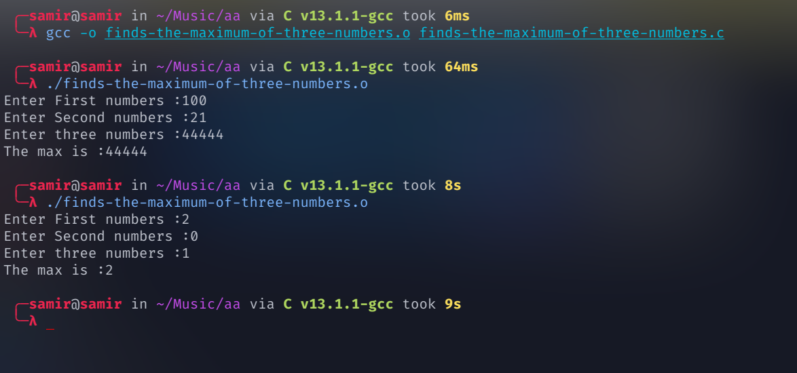

# finds-the-maximum-of-three-numbers
finds-the-maximum-of-three-numbers


compile  c file 

```
 gcc -o finds-the-maximum-of-three-numbers.o finds-the-maximum-of-three-numbers.c
```

Run file 
```
./finds-the-maximum-of-three-numbers.o
```


